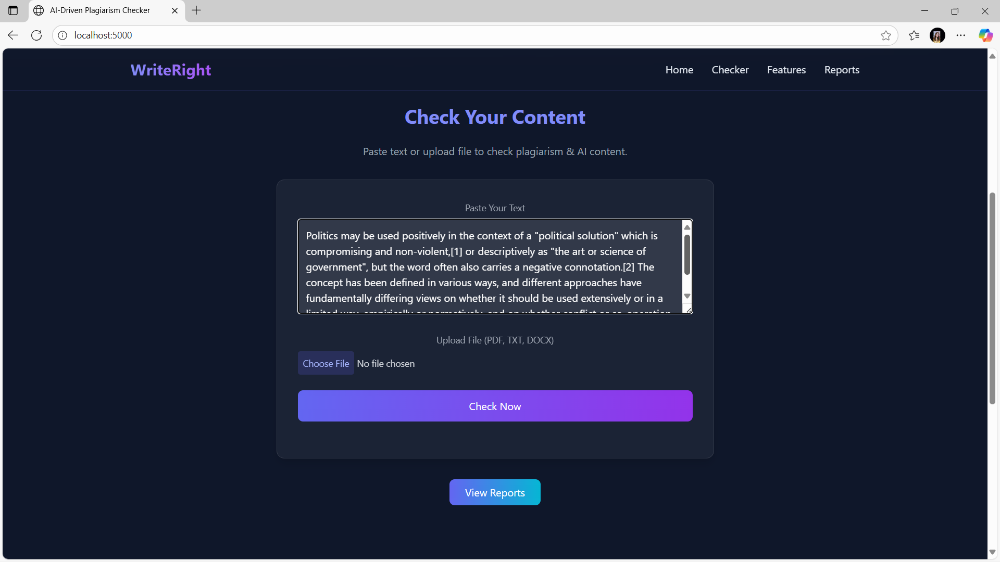
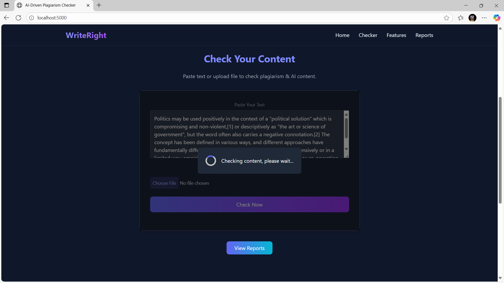
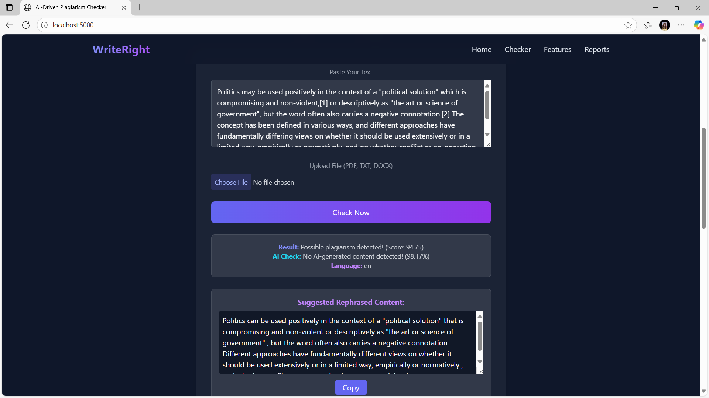
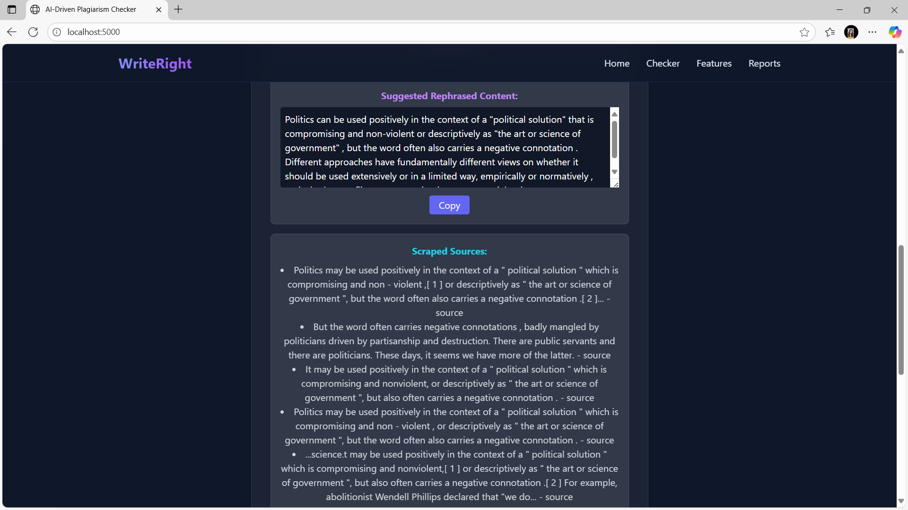
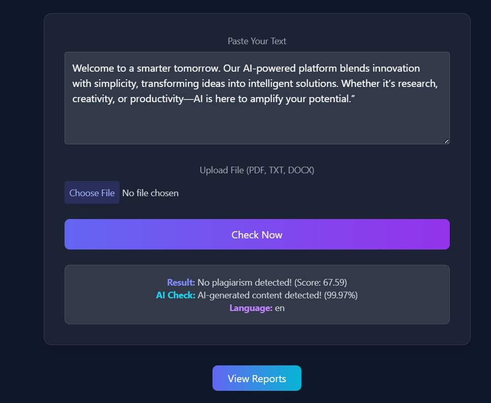
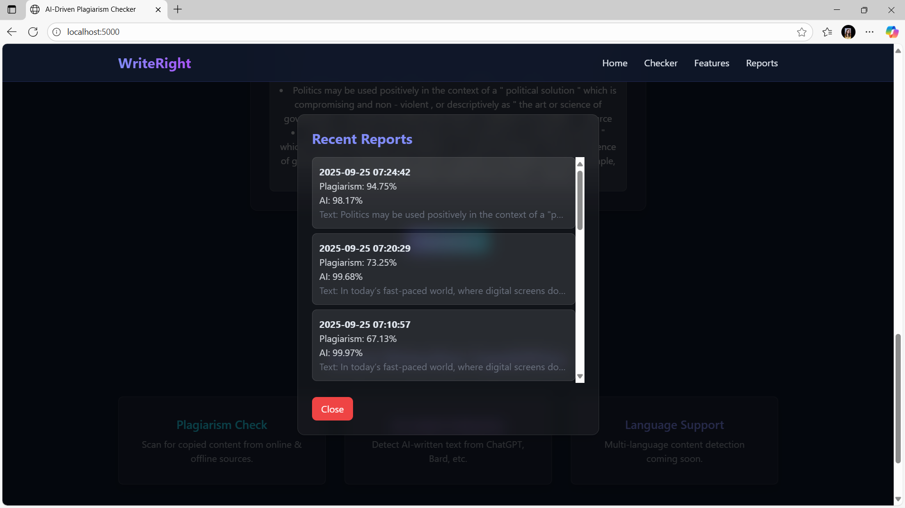

<div align="center">

# 🛡️ Authentic — AI-Driven Plagiarism Detection System

### *Your Originality, Our Mission*

[](https://python.org)
[](https://flask.palletsprojects.com)
[](https://sqlite.org)
[](https://huggingface.co)
[](LICENSE)

An intelligent, AI-powered web application that detects plagiarism, identifies AI-generated content, and suggests rephrased alternatives — all from a single, sleek interface.

---

</div>

## 📑 Table of Contents

- [✨ Features](#-features)
- [📸 Screenshots](#-screenshots)
- [🏗️ System Architecture](#️-system-architecture)
- [🗄️ Database Schema](#️-database-schema)
- [🤖 ML Model Pipeline](#-ml-model-pipeline)
- [🔌 API Reference](#-api-reference)
- [⚙️ Prerequisites](#️-prerequisites)
- [🚀 Installation & Setup](#-installation--setup)
- [🧪 Usage](#-usage)
- [📁 Project Structure](#-project-structure)
- [🛠️ Tech Stack](#️-tech-stack)
- [🐛 Troubleshooting](#-troubleshooting)
- [📄 License](#-license)

---

## ✨ Features

| Feature | Description |
|---|---|
| **🔍 Plagiarism Detection** | Semantic similarity analysis using `paraphrase-mpnet-base-v2` sentence embeddings compared against both a reference corpus and live web-scraped sources. |
| **🤖 AI Content Detection** | Identifies AI-generated text (ChatGPT, Gemini, etc.) using the `roberta-large-openai-detector` classifier. |
| **✍️ Smart Rephrasing** | Automatically generates rephrased content using the `T5_Paraphrase_Paws` model when plagiarism exceeds 70%. |
| **🌐 Live Web Scraping** | Searches the web via DuckDuckGo to find matching online sources in real-time, with built-in caching. |
| **📄 Multi-Format Upload** | Supports `.pdf`, `.docx`, and `.txt` file uploads for document analysis. |
| **🌍 Language Detection** | Automatically detects the language of submitted content using `langdetect`. |
| **📊 Report History** | Stores and displays the 10 most recent analysis reports with timestamps, scores, and confidence levels. |
| **🎨 Glassmorphism UI** | Dark-themed, modern interface with blur effects, gradient accents, and scroll animations. |

---

## 📸 Screenshots

<details>
<summary><b>Click to expand screenshots</b></summary>

### Checker — Paste Text & Upload
Input your text directly or upload a PDF/DOCX/TXT document for analysis.



### Loading State
A loading overlay indicates content is being analyzed across all models.



### Plagiarism Detected — With Rephrased Suggestion
When plagiarism score exceeds 70%, the system automatically generates a rephrased alternative.



### Scraped Web Sources
The system displays real-time web sources that match the submitted content.



### Analysis Result Card
Shows plagiarism score, AI-detection confidence, and detected language in a glassmorphism card.



### Recent Reports Modal
View the 10 most recent check reports with timestamps and scores.



</details>

---

## 🏗️ System Architecture

```
┌─────────────────────────────────────────────────────────────────────┐
│                          CLIENT (Browser)                          │
│                                                                     │
│    ┌──────────────┐   ┌──────────────┐   ┌──────────────────────┐  │
│    │  Text Input   │   │  File Upload  │   │  View Reports Btn   │  │
│    └──────┬───────┘   └──────┬───────┘   └──────────┬───────────┘  │
│           │                  │                       │              │
│           └──────────┬───────┘                       │              │
│                      ▼                               ▼              │
│              POST /check                      GET /reports          │
└──────────────────────┬───────────────────────────────┬──────────────┘
                       │                               │
                       ▼                               ▼
┌─────────────────────────────────────────────────────────────────────┐
│                       FLASK SERVER (app.py)                         │
│                                                                     │
│  ┌─────────────────────────────────────────────────────────────┐    │
│  │                    REQUEST HANDLER                          │    │
│  │                                                             │    │
│  │  1. Extract text from input / file (PDF, DOCX, TXT)        │    │
│  │  2. Detect language (langdetect)                            │    │
│  │  3. Chunk text into 500-word segments                       │    │
│  │  4. Scrape web for similar content (DuckDuckGo)             │    │
│  │  5. Run Plagiarism Model (Sentence-BERT)                    │    │
│  │  6. Run AI Detector (RoBERTa)                               │    │
│  │  7. Rephrase if plagiarism > 70% (T5)                       │    │
│  │  8. Save report to SQLite                                   │    │
│  │  9. Return JSON response                                    │    │
│  └─────────────────────────────────────────────────────────────┘    │
│                                                                     │
│  ┌───────────────┐  ┌───────────────┐  ┌───────────────────────┐   │
│  │ SentenceBERT  │  │   RoBERTa     │  │  T5 Paraphrase        │   │
│  │ (Plagiarism)  │  │ (AI Detect)   │  │  (Rephrasing)         │   │
│  └───────────────┘  └───────────────┘  └───────────────────────┘   │
│                                                                     │
│  ┌───────────────┐  ┌───────────────┐  ┌───────────────────────┐   │
│  │  langdetect   │  │   DuckDuckGo  │  │   In-Memory Cache     │   │
│  │ (Language ID) │  │ (Web Scrape)  │  │   (scrape_cache{})    │   │
│  └───────────────┘  └───────────────┘  └───────────────────────┘   │
└──────────────────────────────┬──────────────────────────────────────┘
                               │
                               ▼
                    ┌─────────────────────┐
                    │   SQLite Database   │
                    │   (plagiarism.db)   │
                    │                     │
                    │  ┌───────────────┐  │
                    │  │    reports    │  │
                    │  ├───────────────┤  │
                    │  │ id (PK)      │  │
                    │  │ text         │  │
                    │  │ plag_score   │  │
                    │  │ ai_conf      │  │
                    │  │ language     │  │
                    │  │ timestamp    │  │
                    │  └───────────────┘  │
                    └─────────────────────┘
```

---

## 🗄️ Database Schema

### SQLite Runtime Database (`plagiarism.db`)

This database is auto-created on first run and stores all analysis reports.

```sql
CREATE TABLE reports (
    id                INTEGER PRIMARY KEY AUTOINCREMENT,
    text              TEXT,                                 -- First 500 chars of input
    plagiarism_score  REAL,                                 -- 0.0 – 100.0
    ai_confidence     REAL,                                 -- 0.0 – 100.0
    language          TEXT,                                  -- ISO 639-1 code (e.g., 'en')
    timestamp         DATETIME DEFAULT CURRENT_TIMESTAMP    -- Auto-generated
);
```

### Extended Schema Reference (`create_db.sql`)

A MySQL-compatible schema is also provided for future scaling:

```sql
CREATE TABLE documents (
    id          INT AUTO_INCREMENT PRIMARY KEY,
    title       VARCHAR(255) NOT NULL,
    content     LONGTEXT NOT NULL,
    uploaded_at TIMESTAMP DEFAULT CURRENT_TIMESTAMP
);

CREATE TABLE embeddings (
    id          INT AUTO_INCREMENT PRIMARY KEY,
    document_id INT NOT NULL,
    embedding   BLOB NOT NULL,
    FOREIGN KEY (document_id) REFERENCES documents(id) ON DELETE CASCADE
);
```

### Entity Relationship Diagram

```
┌──────────────────────┐          ┌──────────────────────────┐
│      documents       │          │        embeddings        │
├──────────────────────┤          ├──────────────────────────┤
│ id          INT (PK) │──── 1:N ──▶│ id          INT (PK)    │
│ title       VARCHAR  │          │ document_id INT (FK)     │
│ content     LONGTEXT │          │ embedding   BLOB         │
│ uploaded_at TIMESTAMP│          └──────────────────────────┘
└──────────────────────┘

┌──────────────────────────────┐
│           reports            │
├──────────────────────────────┤
│ id               INT (PK)   │
│ text             TEXT        │
│ plagiarism_score REAL        │
│ ai_confidence    REAL        │
│ language         TEXT        │
│ timestamp        DATETIME    │
└──────────────────────────────┘
```

---

## 🤖 ML Model Pipeline

The system uses three transformer-based models in sequence:

```
Input Text
    │
    ▼
┌─────────────────────────────────────────────────────────┐
│  Step 1: PLAGIARISM DETECTION                           │
│                                                         │
│  Model: paraphrase-mpnet-base-v2 (Sentence-BERT)       │
│                                                         │
│  • Encodes user text chunks into 768-dim embeddings     │
│  • Compares against reference corpus + web sources      │
│  • Computes cosine similarity scores                    │
│  • Returns max similarity as plagiarism percentage      │
│                                                         │
│  Threshold: > 70% = "Possible plagiarism detected"      │
└──────────────────────────┬──────────────────────────────┘
                           │
                           ▼
┌─────────────────────────────────────────────────────────┐
│  Step 2: AI CONTENT DETECTION                           │
│                                                         │
│  Model: roberta-large-openai-detector                   │
│                                                         │
│  • Classifies first 512 tokens of text                  │
│  • Labels: "Real" vs "AI-Generated"                     │
│  • Reports confidence score as percentage               │
│                                                         │
│  Threshold: label="AI-Generated" AND score > 0.7        │
└──────────────────────────┬──────────────────────────────┘
                           │
                           ▼
┌─────────────────────────────────────────────────────────┐
│  Step 3: REPHRASING (Conditional)                       │
│                                                         │
│  Model: Vamsi/T5_Paraphrase_Paws                        │
│                                                         │
│  • Only triggered if plagiarism score > 70%             │
│  • Uses beam search (num_beams=5) for quality output    │
│  • Applies temperature (0.7) + top-p (0.9) sampling    │
│  • Returns a paraphrased version of the input           │
└─────────────────────────────────────────────────────────┘
```

---

## 🔌 API Reference

### `GET /`

Serves the main single-page application.

---

### `POST /check`

Analyzes text for plagiarism, AI-generated content, and optionally generates a rephrased version.

**Request** — `multipart/form-data`

| Field  | Type   | Required | Description                          |
|--------|--------|----------|--------------------------------------|
| `text` | string | No*      | Raw text to analyze                  |
| `file` | file   | No*      | PDF, DOCX, or TXT file to analyze    |

> \* At least one of `text` or `file` must be provided.

**Response** — `application/json`

```json
{
  "message": "Possible plagiarism detected! (Score: 94.75)",
  "ai_message": "No AI-generated content detected!",
  "ai_confidence": 98.17,
  "language": "en",
  "rephrased": "Politics can be used positively in the context...",
  "scraped_sources": [
    "Politics may be used positively... - <a href='https://...' target='_blank'>source</a>"
  ]
}
```

---

### `GET /reports`

Returns the 10 most recent analysis reports.

**Response** — `application/json`

```json
[
  {
    "id": 1,
    "text": "In today's fast-paced world...",
    "plagiarism_score": 73.25,
    "ai_confidence": 99.68,
    "language": "en",
    "timestamp": "2025-09-25 07:20:29"
  }
]
```

---

### `POST /contact`

Handles contact form submissions.

**Request** — `multipart/form-data`

| Field     | Type   | Required | Description          |
|-----------|--------|----------|----------------------|
| `name`    | string | Yes      | Sender's name        |
| `email`   | string | Yes      | Sender's email       |
| `message` | string | Yes      | Message body         |

---

## ⚙️ Prerequisites

Before you begin, ensure you have the following installed:

| Requirement | Version | Check Command |
|---|---|---|
| **Python** | 3.9 or higher | `python --version` |
| **pip** | Latest | `pip --version` |
| **Git** | Any | `git --version` |
| **Virtual Env** (recommended) | — | `python -m venv --help` |

> **💡 Hardware Note:** The ML models require approximately **4–6 GB of RAM**. A machine with at least **8 GB RAM** is recommended. GPU is optional — the system runs on CPU by default.

---

## 🚀 Installation & Setup

### 1. Clone the Repository

```bash
git clone https://github.com/AbhishekDuhijod319/plagiarism-detection-system.git
cd plagiarism-detection-system
```

### 2. Create a Virtual Environment

```bash
# Windows
python -m venv .venv
.venv\Scripts\activate

# macOS / Linux
python3 -m venv .venv
source .venv/bin/activate
```

### 3. Install Dependencies

```bash
pip install flask sentence-transformers transformers torch PyPDF2 python-docx langdetect duckduckgo-search
```

> **⚠️ Note:** The `requirements.txt` in the repo contains the original dependency list. The command above includes all dependencies actually used by `app.py` at runtime. You can also install from requirements after updating it:
>
> ```bash
> pip install -r requirements.txt
> ```

<details>
<summary><b>📦 Full dependency breakdown</b></summary>

| Package | Purpose |
|---|---|
| `flask` | Web framework & routing |
| `sentence-transformers` | Plagiarism detection via semantic embeddings |
| `transformers` | AI content detection (RoBERTa) & rephrasing (T5) |
| `torch` | PyTorch backend for all ML models |
| `PyPDF2` | PDF text extraction |
| `python-docx` | DOCX text extraction |
| `langdetect` | Automatic language identification |
| `duckduckgo-search` | Web scraping for source comparison |

</details>

### 4. Run the Application

```bash
python app.py
```

### 5. Open in Browser

Navigate to:

```
http://localhost:5000
```

> **⏳ First Run:** The first launch will download the ML models (~2–3 GB). This is a one-time process. Subsequent starts will load from cache.

---

## 🧪 Usage

### Text Input
1. Navigate to the **Checker** section
2. Paste your text into the textarea
3. Click **"Check Now"**
4. View results — plagiarism score, AI detection, and language

### File Upload
1. Click **"Choose File"** and select a `.pdf`, `.docx`, or `.txt` file
2. Click **"Check Now"**
3. The system extracts and analyzes the text automatically

### View Reports
1. Click the **"View Reports"** button below the checker
2. A modal displays the 10 most recent analysis reports
3. Each report shows the timestamp, plagiarism score, AI confidence, and a text preview

### Rephrased Content
- If the plagiarism score exceeds **70%**, a rephrased version is automatically generated
- Click **"Copy"** to copy the rephrased text to your clipboard

---

## 📁 Project Structure

```
plagiarism-detection-system/
│
├── app.py                  # Flask application — routes, models, business logic
├── requirements.txt        # Python package dependencies
├── create_db.sql           # MySQL-compatible schema for future scaling
├── plagiarism.db           # SQLite database (auto-created at runtime)
├── README.md               # Project documentation (this file)
│
├── templates/
│   └── home.html           # Single-page frontend (TailwindCSS + vanilla JS)
│
└── docs/
    └── screenshots/        # Application screenshots
        ├── checker-input.png
        ├── checker-results.png
        ├── loading-state.png
        ├── plagiarism-detected.png
        ├── rephrased-sources.png
        └── reports-modal.png
```

---

## 🛠️ Tech Stack

<div align="center">

| Layer | Technology |
|---|---|
| **Backend** | Python 3.9+, Flask |
| **Frontend** | HTML5, TailwindCSS (CDN), Vanilla JavaScript |
| **Database** | SQLite 3 (runtime), MySQL (reference schema) |
| **Plagiarism Model** | `paraphrase-mpnet-base-v2` (Sentence-BERT) |
| **AI Detector** | `roberta-large-openai-detector` |
| **Rephraser** | `Vamsi/T5_Paraphrase_Paws` |
| **Web Scraping** | DuckDuckGo Search (`ddgs`) |
| **File Parsing** | PyPDF2, python-docx |
| **Language Detection** | langdetect |
| **ML Framework** | PyTorch, HuggingFace Transformers |

</div>

---

## 🐛 Troubleshooting

<details>
<summary><b>❌ Model loading error at startup</b></summary>

**Symptom:** `Model loading error: ...` printed to console.

**Fix:** Ensure you have a stable internet connection on first run. The models are downloaded from HuggingFace Hub. If behind a proxy:

```bash
set HTTPS_PROXY=http://your-proxy:port    # Windows
export HTTPS_PROXY=http://your-proxy:port  # Linux/macOS
```

If disk space is an issue, ensure at least **5 GB** free for model caching.
</details>

<details>
<summary><b>❌ <code>ModuleNotFoundError: No module named 'ddgs'</code></b></summary>

**Fix:** Install the DuckDuckGo search library:

```bash
pip install duckduckgo-search
```

The package is imported as `ddgs` but installed as `duckduckgo-search`.
</details>

<details>
<summary><b>❌ <code>torch</code> installation fails</b></summary>

**Fix:** Install the CPU-only version of PyTorch to save space:

```bash
pip install torch --index-url https://download.pytorch.org/whl/cpu
```
</details>

<details>
<summary><b>❌ PDF extraction returns empty text</b></summary>

**Cause:** Some PDFs contain scanned images instead of selectable text. PyPDF2 cannot extract text from image-based PDFs.

**Workaround:** Use OCR preprocessing (e.g., Tesseract) before uploading, or copy-paste the text manually.
</details>

<details>
<summary><b>❌ Port 5000 already in use</b></summary>

**Fix:** Either stop the process using port 5000, or run Flask on a different port:

```bash
flask run --port 5001
```

Or modify `app.py`:

```python
app.run(debug=True, port=5001)
```
</details>

---

## 🗺️ Roadmap

- [ ] User authentication & per-user report history
- [ ] Batch document analysis
- [ ] Detailed sentence-level highlighting of plagiarized segments
- [ ] GPU acceleration toggle for faster inference
- [ ] Export reports as PDF
- [ ] Multi-language content support beyond English
- [ ] MySQL/PostgreSQL backend for production scaling

---

## 📄 License

This project is open-source and available under the [MIT License](LICENSE).

---

<div align="center">

**Built with ❤️ by [Abhishek Duhijod](https://github.com/AbhishekDuhijod319)**

*If you found this project helpful, consider giving it a ⭐ on GitHub!*

</div>
